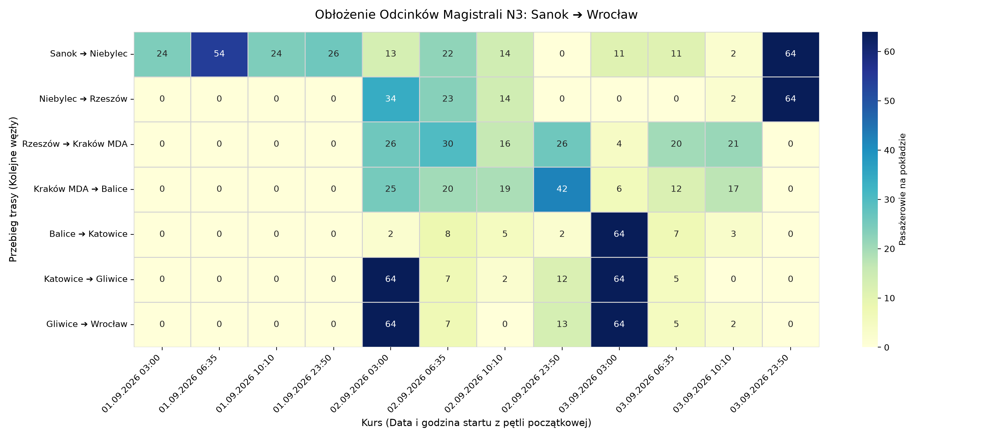
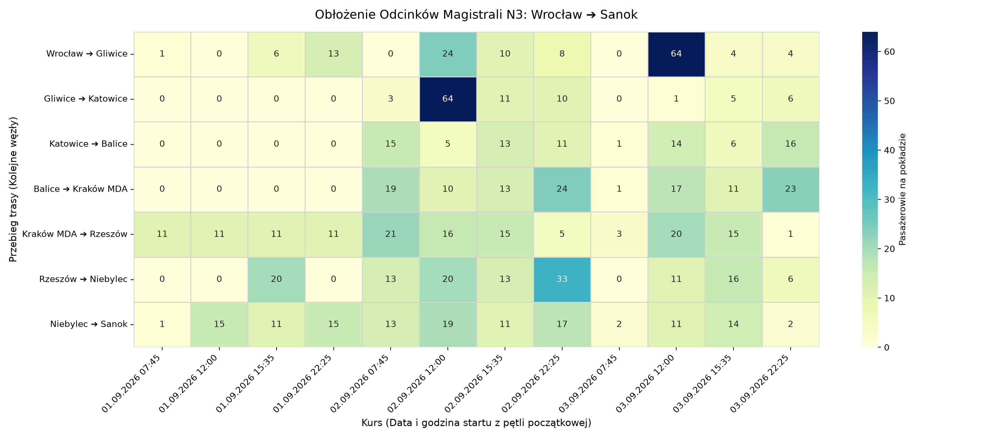

# 🏛️ Project Aether: N3 Transit Observatory

> 🕒 **Ostatnia synchronizacja:** `01.09.2026 17:17:18`  
> 📊 **Status magistrali N3 (Sanok ⇄ Wrocław)** | 8 Węzłów | 7 Odcinków Pomiarowych

## 🧭 Bezpośrednie kursy magistralne (Terminus ➔ Terminus)

| Kierunek | Data | Odjazd | Wolne miejsca | Cena min. |
| :--- | :--- | :---: | :---: | :---: |
| Wrocław ➔ Sanok | 📅 **01.09.2026** | ⏰ 22:25 | `B/D` | 120.65 zł |
| Sanok ➔ Wrocław | 📅 **02.09.2026** | ⏰ 03:00 | `B/D` | 120.65 zł |
| Sanok ➔ Wrocław | 📅 **02.09.2026** | ⏰ 06:35 | `B/D` | 120.65 zł |
| Sanok ➔ Wrocław | 📅 **02.09.2026** | ⏰ 10:10 | `B/D` | 120.65 zł |
| Sanok ➔ Wrocław | 📅 **02.09.2026** | ⏰ 23:50 | `B/D` | 120.65 zł |
| Wrocław ➔ Sanok | 📅 **02.09.2026** | ⏰ 07:45 | `B/D` | 120.65 zł |
| Wrocław ➔ Sanok | 📅 **02.09.2026** | ⏰ 12:00 | `B/D` | 120.65 zł |
| Wrocław ➔ Sanok | 📅 **02.09.2026** | ⏰ 15:35 | `B/D` | 120.65 zł |
| Wrocław ➔ Sanok | 📅 **02.09.2026** | ⏰ 22:25 | `B/D` | 120.65 zł |
| Sanok ➔ Wrocław | 📅 **03.09.2026** | ⏰ 03:00 | `B/D` | 120.65 zł |
| Sanok ➔ Wrocław | 📅 **03.09.2026** | ⏰ 06:35 | `B/D` | 120.65 zł |
| Sanok ➔ Wrocław | 📅 **03.09.2026** | ⏰ 10:10 | `B/D` | 120.65 zł |
| Sanok ➔ Wrocław | 📅 **03.09.2026** | ⏰ 23:50 | `B/D` | 120.65 zł |
| Wrocław ➔ Sanok | 📅 **03.09.2026** | ⏰ 07:45 | `B/D` | 120.65 zł |
| Wrocław ➔ Sanok | 📅 **03.09.2026** | ⏰ 12:00 | `B/D` | 120.65 zł |
| Wrocław ➔ Sanok | 📅 **03.09.2026** | ⏰ 15:35 | `B/D` | 120.65 zł |
| Wrocław ➔ Sanok | 📅 **03.09.2026** | ⏰ 22:25 | `B/D` | 120.65 zł |
| Sanok ➔ Wrocław | 📅 **04.09.2026** | ⏰ 03:00 | `B/D` | 120.65 zł |
| Sanok ➔ Wrocław | 📅 **04.09.2026** | ⏰ 06:35 | `B/D` | 120.65 zł |
| Sanok ➔ Wrocław | 📅 **04.09.2026** | ⏰ 10:10 | `B/D` | 120.65 zł |

---

## 📈 Analityka Węzłowa: Potoki, Wymiana Pasażerska (Δ) i Estymacja Obrotów

### 🚌 Sanok ➔ Wrocław: `Poranny I (03:00)` | 📅 Data: **01.09.2026**
> 💵 **Szacowany obrót kursu:** `570.00 PLN` | 📊 **Średni Load Factor:** `5.3%`

| Odcinek | Odjazd | Cena | Wolne | Na pokładzie | Bilans w węźle (Δ) | Obrót odcinka |
| :--- | :---: | :---: | :---: | :---: | :---: | :---: |
| Sanok ➔ Niebylec | ⏰ 03:00 | 23.75 zł | `41` | **24/65** | Start trasy | **570.00 zł** |
| Niebylec ➔ Rzeszów | ⏰ 04:00 | 0.00 zł | `B/D` | **0/65** | 📉 -24 | **0.00 zł** |
| Rzeszów ➔ Kraków MDA | ⏰ 04:40 | 0.00 zł | `B/D` | **0/65** | ➡️ 0 | **0.00 zł** |
| Kraków MDA ➔ Balice | ⏰ 06:55 | 0.00 zł | `B/D` | **0/65** | ➡️ 0 | **0.00 zł** |
| Balice ➔ Katowice | ⏰ 07:20 | 0.00 zł | `B/D` | **0/65** | ➡️ 0 | **0.00 zł** |
| Katowice ➔ Gliwice | ⏰ 08:30 | 0.00 zł | `B/D` | **0/65** | ➡️ 0 | **0.00 zł** |
| Gliwice ➔ Wrocław | ⏰ 09:00 | 0.00 zł | `B/D` | **0/65** | ➡️ 0 | **0.00 zł** |

### 🚌 Sanok ➔ Wrocław: `Poranny II (06:35)` | 📅 Data: **01.09.2026**
> 💵 **Szacowany obrót kursu:** `1282.50 PLN` | 📊 **Średni Load Factor:** `11.9%`

| Odcinek | Odjazd | Cena | Wolne | Na pokładzie | Bilans w węźle (Δ) | Obrót odcinka |
| :--- | :---: | :---: | :---: | :---: | :---: | :---: |
| Sanok ➔ Niebylec | ⏰ 06:35 | 23.75 zł | `11` | **54/65** | Start trasy | **1282.50 zł** |
| Niebylec ➔ Rzeszów | ⏰ 07:40 | 0.00 zł | `B/D` | **0/65** | 📉 -54 | **0.00 zł** |
| Rzeszów ➔ Kraków MDA | ⏰ 08:40 | 0.00 zł | `B/D` | **0/65** | ➡️ 0 | **0.00 zł** |
| Kraków MDA ➔ Balice | ⏰ 10:55 | 0.00 zł | `B/D` | **0/65** | ➡️ 0 | **0.00 zł** |
| Balice ➔ Katowice | ⏰ 11:30 | 0.00 zł | `B/D` | **0/65** | ➡️ 0 | **0.00 zł** |
| Katowice ➔ Gliwice | ⏰ 12:30 | 0.00 zł | `B/D` | **0/65** | ➡️ 0 | **0.00 zł** |
| Gliwice ➔ Wrocław | ⏰ 13:00 | 0.00 zł | `B/D` | **0/65** | ➡️ 0 | **0.00 zł** |

### 🚌 Wrocław ➔ Sanok: `Poranny (07:45)` | 📅 Data: **01.09.2026**
> 💵 **Szacowany obrót kursu:** `525.85 PLN` | 📊 **Średni Load Factor:** `2.9%`

| Odcinek | Odjazd | Cena | Wolne | Na pokładzie | Bilans w węźle (Δ) | Obrót odcinka |
| :--- | :---: | :---: | :---: | :---: | :---: | :---: |
| Wrocław ➔ Gliwice | ⏰ 07:45 | 34.45 zł | `64` | **1/65** | Start trasy | **34.45 zł** |
| Gliwice ➔ Katowice | ⏰ 09:45 | 0.00 zł | `B/D` | **0/65** | 📉 -1 | **0.00 zł** |
| Katowice ➔ Balice | ⏰ 10:15 | 0.00 zł | `B/D` | **0/65** | ➡️ 0 | **0.00 zł** |
| Balice ➔ Kraków MDA | ⏰ 11:05 | 0.00 zł | `B/D` | **0/65** | ➡️ 0 | **0.00 zł** |
| Kraków MDA ➔ Rzeszów | ⏰ 11:45 | 42.40 zł | `54` | **11/65** | 📈 +11 | **466.40 zł** |
| Rzeszów ➔ Niebylec | ⏰ 13:50 | 0.00 zł | `B/D` | **0/65** | 📉 -11 | **0.00 zł** |
| Niebylec ➔ Sanok | ⏰ 14:35 | 25.00 zł | `64` | **1/65** | 📈 +1 | **25.00 zł** |

### 🚌 Sanok ➔ Wrocław: `Południowy (10:10)` | 📅 Data: **01.09.2026**
> 💵 **Szacowany obrót kursu:** `570.00 PLN` | 📊 **Średni Load Factor:** `5.3%`

| Odcinek | Odjazd | Cena | Wolne | Na pokładzie | Bilans w węźle (Δ) | Obrót odcinka |
| :--- | :---: | :---: | :---: | :---: | :---: | :---: |
| Sanok ➔ Niebylec | ⏰ 10:10 | 23.75 zł | `41` | **24/65** | Start trasy | **570.00 zł** |
| Niebylec ➔ Rzeszów | ⏰ 11:25 | 0.00 zł | `B/D` | **0/65** | 📉 -24 | **0.00 zł** |
| Rzeszów ➔ Kraków MDA | ⏰ 12:20 | 0.00 zł | `B/D` | **0/65** | ➡️ 0 | **0.00 zł** |
| Kraków MDA ➔ Balice | ⏰ 14:40 | 0.00 zł | `B/D` | **0/65** | ➡️ 0 | **0.00 zł** |
| Balice ➔ Katowice | ⏰ 15:15 | 0.00 zł | `B/D` | **0/65** | ➡️ 0 | **0.00 zł** |
| Katowice ➔ Gliwice | ⏰ 16:25 | 0.00 zł | `B/D` | **0/65** | ➡️ 0 | **0.00 zł** |
| Gliwice ➔ Wrocław | ⏰ 16:55 | 0.00 zł | `B/D` | **0/65** | ➡️ 0 | **0.00 zł** |

### 🚌 Wrocław ➔ Sanok: `Południowy (12:00)` | 📅 Data: **01.09.2026**
> 💵 **Szacowany obrót kursu:** `841.40 PLN` | 📊 **Średni Load Factor:** `4.1%`

| Odcinek | Odjazd | Cena | Wolne | Na pokładzie | Bilans w węźle (Δ) | Obrót odcinka |
| :--- | :---: | :---: | :---: | :---: | :---: | :---: |
| Wrocław ➔ Gliwice | ⏰ 12:00 | 0.00 zł | `B/D` | **0/65** | Start trasy | **0.00 zł** |
| Gliwice ➔ Katowice | ⏰ 14:00 | 0.00 zł | `B/D` | **0/65** | ➡️ 0 | **0.00 zł** |
| Katowice ➔ Balice | ⏰ 14:30 | 0.00 zł | `B/D` | **0/65** | ➡️ 0 | **0.00 zł** |
| Balice ➔ Kraków MDA | ⏰ 15:20 | 0.00 zł | `B/D` | **0/65** | ➡️ 0 | **0.00 zł** |
| Kraków MDA ➔ Rzeszów | ⏰ 16:15 | 42.40 zł | `54` | **11/65** | 📈 +11 | **466.40 zł** |
| Rzeszów ➔ Niebylec | ⏰ 18:40 | 0.00 zł | `B/D` | **0/65** | 📉 -11 | **0.00 zł** |
| Niebylec ➔ Sanok | ⏰ 19:20 | 25.00 zł | `75` | **15/90** | 📈 +15 | **375.00 zł** |

### 🚌 Wrocław ➔ Sanok: `Popołudniowy (15:35)` | 📅 Data: **01.09.2026**
> 💵 **Szacowany obrót kursu:** `1214.10 PLN` | 📊 **Średni Load Factor:** `7.6%`

| Odcinek | Odjazd | Cena | Wolne | Na pokładzie | Bilans w węźle (Δ) | Obrót odcinka |
| :--- | :---: | :---: | :---: | :---: | :---: | :---: |
| Wrocław ➔ Gliwice | ⏰ 15:35 | 34.45 zł | `84` | **6/90** | Start trasy | **206.70 zł** |
| Gliwice ➔ Katowice | ⏰ 17:40 | 0.00 zł | `B/D` | **0/65** | 📉 -6 | **0.00 zł** |
| Katowice ➔ Balice | ⏰ 18:15 | 0.00 zł | `B/D` | **0/65** | ➡️ 0 | **0.00 zł** |
| Balice ➔ Kraków MDA | ⏰ 19:05 | 0.00 zł | `B/D` | **0/65** | ➡️ 0 | **0.00 zł** |
| Kraków MDA ➔ Rzeszów | ⏰ 19:45 | 42.40 zł | `54` | **11/65** | 📈 +11 | **466.40 zł** |
| Rzeszów ➔ Niebylec | ⏰ 21:55 | 13.30 zł | `45` | **20/65** | 📈 +9 | **266.00 zł** |
| Niebylec ➔ Sanok | ⏰ 22:30 | 25.00 zł | `54` | **11/65** | 📉 -9 | **275.00 zł** |

### 🚌 Wrocław ➔ Sanok: `Nocny (22:25)` | 📅 Data: **01.09.2026**
> 💵 **Szacowany obrót kursu:** `1289.25 PLN` | 📊 **Średni Load Factor:** `6.2%`

| Odcinek | Odjazd | Cena | Wolne | Na pokładzie | Bilans w węźle (Δ) | Obrót odcinka |
| :--- | :---: | :---: | :---: | :---: | :---: | :---: |
| Wrocław ➔ Gliwice | ⏰ 22:25 | 34.45 zł | `77` | **13/90** | Start trasy | **447.85 zł** |
| Gliwice ➔ Katowice | ⏰ 00:20 | 0.00 zł | `B/D` | **0/65** | 📉 -13 | **0.00 zł** |
| Katowice ➔ Balice | ⏰ 00:50 | 0.00 zł | `B/D` | **0/65** | ➡️ 0 | **0.00 zł** |
| Balice ➔ Kraków MDA | ⏰ 01:50 | 0.00 zł | `B/D` | **0/65** | ➡️ 0 | **0.00 zł** |
| Kraków MDA ➔ Rzeszów | ⏰ 02:20 | 42.40 zł | `54` | **11/65** | 📈 +11 | **466.40 zł** |
| Rzeszów ➔ Niebylec | ⏰ 04:30 | 0.00 zł | `B/D` | **0/65** | 📉 -11 | **0.00 zł** |
| Niebylec ➔ Sanok | ⏰ 05:00 | 25.00 zł | `75` | **15/90** | 📈 +15 | **375.00 zł** |

### 🚌 Sanok ➔ Wrocław: `Nocny (23:50)` | 📅 Data: **01.09.2026**
> 💵 **Szacowany obrót kursu:** `617.50 PLN` | 📊 **Średni Load Factor:** `5.7%`

| Odcinek | Odjazd | Cena | Wolne | Na pokładzie | Bilans w węźle (Δ) | Obrót odcinka |
| :--- | :---: | :---: | :---: | :---: | :---: | :---: |
| Sanok ➔ Niebylec | ⏰ 23:50 | 23.75 zł | `39` | **26/65** | Start trasy | **617.50 zł** |
| Niebylec ➔ Rzeszów | ⏰ 00:50 | 0.00 zł | `B/D` | **0/65** | 📉 -26 | **0.00 zł** |
| Rzeszów ➔ Kraków MDA | ⏰ 01:30 | 0.00 zł | `B/D` | **0/65** | ➡️ 0 | **0.00 zł** |
| Kraków MDA ➔ Balice | ⏰ 03:35 | 0.00 zł | `B/D` | **0/65** | ➡️ 0 | **0.00 zł** |
| Balice ➔ Katowice | ⏰ 04:00 | 0.00 zł | `B/D` | **0/65** | ➡️ 0 | **0.00 zł** |
| Katowice ➔ Gliwice | ⏰ 04:55 | 0.00 zł | `B/D` | **0/65** | ➡️ 0 | **0.00 zł** |
| Gliwice ➔ Wrocław | ⏰ 05:22 | 0.00 zł | `B/D` | **0/65** | ➡️ 0 | **0.00 zł** |

### 🚌 Sanok ➔ Wrocław: `Poranny I (03:00)` | 📅 Data: **02.09.2026**
> 💵 **Szacowany obrót kursu:** `6072.55 PLN` | 📊 **Średni Load Factor:** `50.1%`

| Odcinek | Odjazd | Cena | Wolne | Na pokładzie | Bilans w węźle (Δ) | Obrót odcinka |
| :--- | :---: | :---: | :---: | :---: | :---: | :---: |
| Sanok ➔ Niebylec | ⏰ 03:00 | 23.75 zł | `52` | **13/65** | Start trasy | **308.75 zł** |
| Niebylec ➔ Rzeszów | ⏰ 04:00 | 14.00 zł | `31` | **34/65** | 📈 +21 | **476.00 zł** |
| Rzeszów ➔ Kraków MDA | ⏰ 04:40 | 42.40 zł | `39` | **26/65** | 📉 -8 | **1102.40 zł** |
| Kraków MDA ➔ Balice | ⏰ 06:55 | 27.00 zł | `40` | **25/65** | 📉 -1 | **675.00 zł** |
| Balice ➔ Katowice | ⏰ 07:20 | 48.00 zł | `63` | **2/65** | 📉 -23 | **96.00 zł** |
| Katowice ➔ Gliwice | ⏰ 08:30 | 18.90 zł | `1` | **64/65** | 📈 +62 | **1209.60 zł** |
| Gliwice ➔ Wrocław | ⏰ 09:00 | 34.45 zł | `1` | **64/65** | ➡️ 0 | **2204.80 zł** |

### 🚌 Sanok ➔ Wrocław: `Poranny II (06:35)` | 📅 Data: **02.09.2026**
> 💵 **Szacowany obrót kursu:** `3413.95 PLN` | 📊 **Średni Load Factor:** `25.7%`

| Odcinek | Odjazd | Cena | Wolne | Na pokładzie | Bilans w węźle (Δ) | Obrót odcinka |
| :--- | :---: | :---: | :---: | :---: | :---: | :---: |
| Sanok ➔ Niebylec | ⏰ 06:35 | 23.75 zł | `43` | **22/65** | Start trasy | **522.50 zł** |
| Niebylec ➔ Rzeszów | ⏰ 07:40 | 14.00 zł | `42` | **23/65** | 📈 +1 | **322.00 zł** |
| Rzeszów ➔ Kraków MDA | ⏰ 08:40 | 42.40 zł | `35` | **30/65** | 📈 +7 | **1272.00 zł** |
| Kraków MDA ➔ Balice | ⏰ 10:55 | 27.00 zł | `45` | **20/65** | 📉 -10 | **540.00 zł** |
| Balice ➔ Katowice | ⏰ 11:30 | 48.00 zł | `57` | **8/65** | 📉 -12 | **384.00 zł** |
| Katowice ➔ Gliwice | ⏰ 12:30 | 18.90 zł | `58` | **7/65** | 📉 -1 | **132.30 zł** |
| Gliwice ➔ Wrocław | ⏰ 13:00 | 34.45 zł | `58` | **7/65** | ➡️ 0 | **241.15 zł** |

### 🚌 Wrocław ➔ Sanok: `Poranny (07:45)` | 📅 Data: **02.09.2026**
> 💵 **Szacowany obrót kursu:** `2645.15 PLN` | 📊 **Średni Load Factor:** `13.3%`

| Odcinek | Odjazd | Cena | Wolne | Na pokładzie | Bilans w węźle (Δ) | Obrót odcinka |
| :--- | :---: | :---: | :---: | :---: | :---: | :---: |
| Wrocław ➔ Gliwice | ⏰ 07:45 | 34.45 zł | `90` | **0/90** | Start trasy | **0.00 zł** |
| Gliwice ➔ Katowice | ⏰ 09:45 | 19.95 zł | `87` | **3/90** | 📈 +3 | **59.85 zł** |
| Katowice ➔ Balice | ⏰ 10:15 | 45.60 zł | `75` | **15/90** | 📈 +12 | **684.00 zł** |
| Balice ➔ Kraków MDA | ⏰ 11:05 | 27.00 zł | `71` | **19/90** | 📈 +4 | **513.00 zł** |
| Kraków MDA ➔ Rzeszów | ⏰ 11:45 | 42.40 zł | `69` | **21/90** | 📈 +2 | **890.40 zł** |
| Rzeszów ➔ Niebylec | ⏰ 13:50 | 13.30 zł | `52` | **13/65** | 📉 -8 | **172.90 zł** |
| Niebylec ➔ Sanok | ⏰ 14:35 | 25.00 zł | `52` | **13/65** | ➡️ 0 | **325.00 zł** |

### 🚌 Sanok ➔ Wrocław: `Południowy (10:10)` | 📅 Data: **02.09.2026**
> 💵 **Szacowany obrót kursu:** `1997.70 PLN` | 📊 **Średni Load Factor:** `11.1%`

| Odcinek | Odjazd | Cena | Wolne | Na pokładzie | Bilans w węźle (Δ) | Obrót odcinka |
| :--- | :---: | :---: | :---: | :---: | :---: | :---: |
| Sanok ➔ Niebylec | ⏰ 10:10 | 23.75 zł | `51` | **14/65** | Start trasy | **332.50 zł** |
| Niebylec ➔ Rzeszów | ⏰ 11:25 | 14.00 zł | `51` | **14/65** | ➡️ 0 | **196.00 zł** |
| Rzeszów ➔ Kraków MDA | ⏰ 12:20 | 42.40 zł | `49` | **16/65** | 📈 +2 | **678.40 zł** |
| Kraków MDA ➔ Balice | ⏰ 14:40 | 27.00 zł | `71` | **19/90** | 📈 +3 | **513.00 zł** |
| Balice ➔ Katowice | ⏰ 15:15 | 48.00 zł | `85` | **5/90** | 📉 -14 | **240.00 zł** |
| Katowice ➔ Gliwice | ⏰ 16:25 | 18.90 zł | `88` | **2/90** | 📉 -3 | **37.80 zł** |
| Gliwice ➔ Wrocław | ⏰ 16:55 | 34.45 zł | `90` | **0/90** | 📉 -2 | **0.00 zł** |

### 🚌 Wrocław ➔ Sanok: `Południowy (12:00)` | 📅 Data: **02.09.2026**
> 💵 **Szacowany obrót kursu:** `4021.00 PLN` | 📊 **Średni Load Factor:** `25.1%`

| Odcinek | Odjazd | Cena | Wolne | Na pokładzie | Bilans w węźle (Δ) | Obrót odcinka |
| :--- | :---: | :---: | :---: | :---: | :---: | :---: |
| Wrocław ➔ Gliwice | ⏰ 12:00 | 34.45 zł | `66` | **24/90** | Start trasy | **826.80 zł** |
| Gliwice ➔ Katowice | ⏰ 14:00 | 19.95 zł | `1` | **64/65** | 📈 +40 | **1276.80 zł** |
| Katowice ➔ Balice | ⏰ 14:30 | 45.60 zł | `60` | **5/65** | 📉 -59 | **228.00 zł** |
| Balice ➔ Kraków MDA | ⏰ 15:20 | 27.00 zł | `55` | **10/65** | 📈 +5 | **270.00 zł** |
| Kraków MDA ➔ Rzeszów | ⏰ 16:15 | 42.40 zł | `49` | **16/65** | 📈 +6 | **678.40 zł** |
| Rzeszów ➔ Niebylec | ⏰ 18:40 | 13.30 zł | `45` | **20/65** | 📈 +4 | **266.00 zł** |
| Niebylec ➔ Sanok | ⏰ 19:20 | 25.00 zł | `46` | **19/65** | 📉 -1 | **475.00 zł** |

### 🚌 Wrocław ➔ Sanok: `Popołudniowy (15:35)` | 📅 Data: **02.09.2026**
> 💵 **Szacowany obrót kursu:** `2591.65 PLN` | 📊 **Średni Load Factor:** `18.9%`

| Odcinek | Odjazd | Cena | Wolne | Na pokładzie | Bilans w węźle (Δ) | Obrót odcinka |
| :--- | :---: | :---: | :---: | :---: | :---: | :---: |
| Wrocław ➔ Gliwice | ⏰ 15:35 | 34.45 zł | `55` | **10/65** | Start trasy | **344.50 zł** |
| Gliwice ➔ Katowice | ⏰ 17:40 | 19.95 zł | `54` | **11/65** | 📈 +1 | **219.45 zł** |
| Katowice ➔ Balice | ⏰ 18:15 | 45.60 zł | `52` | **13/65** | 📈 +2 | **592.80 zł** |
| Balice ➔ Kraków MDA | ⏰ 19:05 | 27.00 zł | `52` | **13/65** | ➡️ 0 | **351.00 zł** |
| Kraków MDA ➔ Rzeszów | ⏰ 19:45 | 42.40 zł | `50` | **15/65** | 📈 +2 | **636.00 zł** |
| Rzeszów ➔ Niebylec | ⏰ 21:55 | 13.30 zł | `52` | **13/65** | 📉 -2 | **172.90 zł** |
| Niebylec ➔ Sanok | ⏰ 22:30 | 25.00 zł | `54` | **11/65** | 📉 -2 | **275.00 zł** |

### 🚌 Wrocław ➔ Sanok: `Nocny (22:25)` | 📅 Data: **02.09.2026**
> 💵 **Szacowany obrót kursu:** `2700.60 PLN` | 📊 **Średni Load Factor:** `17.1%`

| Odcinek | Odjazd | Cena | Wolne | Na pokładzie | Bilans w węźle (Δ) | Obrót odcinka |
| :--- | :---: | :---: | :---: | :---: | :---: | :---: |
| Wrocław ➔ Gliwice | ⏰ 22:25 | 34.45 zł | `82` | **8/90** | Start trasy | **275.60 zł** |
| Gliwice ➔ Katowice | ⏰ 00:20 | 19.95 zł | `80` | **10/90** | 📈 +2 | **199.50 zł** |
| Katowice ➔ Balice | ⏰ 00:50 | 45.60 zł | `79` | **11/90** | 📈 +1 | **501.60 zł** |
| Balice ➔ Kraków MDA | ⏰ 01:50 | 27.00 zł | `66` | **24/90** | 📈 +13 | **648.00 zł** |
| Kraków MDA ➔ Rzeszów | ⏰ 02:20 | 42.40 zł | `60` | **5/65** | 📉 -19 | **212.00 zł** |
| Rzeszów ➔ Niebylec | ⏰ 04:30 | 13.30 zł | `32` | **33/65** | 📈 +28 | **438.90 zł** |
| Niebylec ➔ Sanok | ⏰ 05:00 | 25.00 zł | `48` | **17/65** | 📉 -16 | **425.00 zł** |

### 🚌 Sanok ➔ Wrocław: `Nocny (23:50)` | 📅 Data: **02.09.2026**
> 💵 **Szacowany obrót kursu:** `3007.05 PLN` | 📊 **Średni Load Factor:** `15.1%`

| Odcinek | Odjazd | Cena | Wolne | Na pokładzie | Bilans w węźle (Δ) | Obrót odcinka |
| :--- | :---: | :---: | :---: | :---: | :---: | :---: |
| Sanok ➔ Niebylec | ⏰ 23:50 | 0.00 zł | `B/D` | **0/65** | Start trasy | **0.00 zł** |
| Niebylec ➔ Rzeszów | ⏰ 00:50 | 0.00 zł | `B/D` | **0/65** | ➡️ 0 | **0.00 zł** |
| Rzeszów ➔ Kraków MDA | ⏰ 01:30 | 42.40 zł | `39` | **26/65** | 📈 +26 | **1102.40 zł** |
| Kraków MDA ➔ Balice | ⏰ 03:35 | 27.00 zł | `23` | **42/65** | 📈 +16 | **1134.00 zł** |
| Balice ➔ Katowice | ⏰ 04:00 | 48.00 zł | `63` | **2/65** | 📉 -40 | **96.00 zł** |
| Katowice ➔ Gliwice | ⏰ 04:55 | 18.90 zł | `78` | **12/90** | 📈 +10 | **226.80 zł** |
| Gliwice ➔ Wrocław | ⏰ 05:22 | 34.45 zł | `77` | **13/90** | 📈 +1 | **447.85 zł** |

### 🚌 Wrocław ➔ Sanok: `Poranny (07:45)` | 📅 Data: **03.09.2026**
> 💵 **Szacowany obrót kursu:** `249.80 PLN` | 📊 **Średni Load Factor:** `1.1%`

| Odcinek | Odjazd | Cena | Wolne | Na pokładzie | Bilans w węźle (Δ) | Obrót odcinka |
| :--- | :---: | :---: | :---: | :---: | :---: | :---: |
| Wrocław ➔ Gliwice | ⏰ 07:45 | 0.00 zł | `B/D` | **0/65** | Start trasy | **0.00 zł** |
| Gliwice ➔ Katowice | ⏰ 09:45 | 19.95 zł | `90` | **0/90** | ➡️ 0 | **0.00 zł** |
| Katowice ➔ Balice | ⏰ 10:15 | 45.60 zł | `89` | **1/90** | 📈 +1 | **45.60 zł** |
| Balice ➔ Kraków MDA | ⏰ 11:05 | 27.00 zł | `89` | **1/90** | ➡️ 0 | **27.00 zł** |
| Kraków MDA ➔ Rzeszów | ⏰ 11:45 | 42.40 zł | `87` | **3/90** | 📈 +2 | **127.20 zł** |
| Rzeszów ➔ Niebylec | ⏰ 13:50 | 0.00 zł | `B/D` | **0/65** | 📉 -3 | **0.00 zł** |
| Niebylec ➔ Sanok | ⏰ 14:35 | 25.00 zł | `63` | **2/65** | 📈 +2 | **50.00 zł** |

### 🚌 Wrocław ➔ Sanok: `Południowy (12:00)` | 📅 Data: **03.09.2026**
> 💵 **Szacowany obrót kursu:** `4591.45 PLN` | 📊 **Średni Load Factor:** `30.3%`

| Odcinek | Odjazd | Cena | Wolne | Na pokładzie | Bilans w węźle (Δ) | Obrót odcinka |
| :--- | :---: | :---: | :---: | :---: | :---: | :---: |
| Wrocław ➔ Gliwice | ⏰ 12:00 | 34.45 zł | `1` | **64/65** | Start trasy | **2204.80 zł** |
| Gliwice ➔ Katowice | ⏰ 14:00 | 19.95 zł | `64` | **1/65** | 📉 -63 | **19.95 zł** |
| Katowice ➔ Balice | ⏰ 14:30 | 45.60 zł | `51` | **14/65** | 📈 +13 | **638.40 zł** |
| Balice ➔ Kraków MDA | ⏰ 15:20 | 27.00 zł | `48` | **17/65** | 📈 +3 | **459.00 zł** |
| Kraków MDA ➔ Rzeszów | ⏰ 16:15 | 42.40 zł | `45` | **20/65** | 📈 +3 | **848.00 zł** |
| Rzeszów ➔ Niebylec | ⏰ 18:40 | 13.30 zł | `54` | **11/65** | 📉 -9 | **146.30 zł** |
| Niebylec ➔ Sanok | ⏰ 19:20 | 25.00 zł | `54` | **11/65** | ➡️ 0 | **275.00 zł** |

### 🚌 Wrocław ➔ Sanok: `Popołudniowy (15:35)` | 📅 Data: **03.09.2026**
> 💵 **Szacowany obrót kursu:** `2006.95 PLN` | 📊 **Średni Load Factor:** `15.6%`

| Odcinek | Odjazd | Cena | Wolne | Na pokładzie | Bilans w węźle (Δ) | Obrót odcinka |
| :--- | :---: | :---: | :---: | :---: | :---: | :---: |
| Wrocław ➔ Gliwice | ⏰ 15:35 | 34.45 zł | `61` | **4/65** | Start trasy | **137.80 zł** |
| Gliwice ➔ Katowice | ⏰ 17:40 | 19.95 zł | `60` | **5/65** | 📈 +1 | **99.75 zł** |
| Katowice ➔ Balice | ⏰ 18:15 | 45.60 zł | `59` | **6/65** | 📈 +1 | **273.60 zł** |
| Balice ➔ Kraków MDA | ⏰ 19:05 | 27.00 zł | `54` | **11/65** | 📈 +5 | **297.00 zł** |
| Kraków MDA ➔ Rzeszów | ⏰ 19:45 | 42.40 zł | `50` | **15/65** | 📈 +4 | **636.00 zł** |
| Rzeszów ➔ Niebylec | ⏰ 21:55 | 13.30 zł | `49` | **16/65** | 📈 +1 | **212.80 zł** |
| Niebylec ➔ Sanok | ⏰ 22:30 | 25.00 zł | `51` | **14/65** | 📉 -2 | **350.00 zł** |

### 🚌 Wrocław ➔ Sanok: `Nocny (22:25)` | 📅 Data: **03.09.2026**
> 💵 **Szacowany obrót kursu:** `1780.30 PLN` | 📊 **Średni Load Factor:** `9.2%`

| Odcinek | Odjazd | Cena | Wolne | Na pokładzie | Bilans w węźle (Δ) | Obrót odcinka |
| :--- | :---: | :---: | :---: | :---: | :---: | :---: |
| Wrocław ➔ Gliwice | ⏰ 22:25 | 34.45 zł | `86` | **4/90** | Start trasy | **137.80 zł** |
| Gliwice ➔ Katowice | ⏰ 00:20 | 19.95 zł | `84` | **6/90** | 📈 +2 | **119.70 zł** |
| Katowice ➔ Balice | ⏰ 00:50 | 45.60 zł | `74` | **16/90** | 📈 +10 | **729.60 zł** |
| Balice ➔ Kraków MDA | ⏰ 01:50 | 27.00 zł | `67` | **23/90** | 📈 +7 | **621.00 zł** |
| Kraków MDA ➔ Rzeszów | ⏰ 02:20 | 42.40 zł | `64` | **1/65** | 📉 -22 | **42.40 zł** |
| Rzeszów ➔ Niebylec | ⏰ 04:30 | 13.30 zł | `59` | **6/65** | 📈 +5 | **79.80 zł** |
| Niebylec ➔ Sanok | ⏰ 05:00 | 25.00 zł | `63` | **2/65** | 📉 -4 | **50.00 zł** |

### 🚌 Sanok ➔ Wrocław: `Nocny (23:50)` | 📅 Data: **03.09.2026**
> 💵 **Szacowany obrót kursu:** `2416.00 PLN` | 📊 **Średni Load Factor:** `28.1%`

| Odcinek | Odjazd | Cena | Wolne | Na pokładzie | Bilans w węźle (Δ) | Obrót odcinka |
| :--- | :---: | :---: | :---: | :---: | :---: | :---: |
| Sanok ➔ Niebylec | ⏰ 23:50 | 23.75 zł | `1` | **64/65** | Start trasy | **1520.00 zł** |
| Niebylec ➔ Rzeszów | ⏰ 00:50 | 14.00 zł | `1` | **64/65** | ➡️ 0 | **896.00 zł** |
| Rzeszów ➔ Kraków MDA | ⏰ 01:30 | 0.00 zł | `B/D` | **0/65** | 📉 -64 | **0.00 zł** |
| Kraków MDA ➔ Balice | ⏰ 03:35 | 0.00 zł | `B/D` | **0/65** | ➡️ 0 | **0.00 zł** |
| Balice ➔ Katowice | ⏰ 04:00 | 0.00 zł | `B/D` | **0/65** | ➡️ 0 | **0.00 zł** |
| Katowice ➔ Gliwice | ⏰ 04:55 | 0.00 zł | `B/D` | **0/65** | ➡️ 0 | **0.00 zł** |
| Gliwice ➔ Wrocław | ⏰ 05:22 | 0.00 zł | `B/D` | **0/65** | ➡️ 0 | **0.00 zł** |

---

## 🗺️ Macierz Obłożenia Magistrali N3

### 🚌 Trasa Zachodnia (Sanok ➔ Wrocław)

### 🚌 Trasa Wschodnia (Wrocław ➔ Sanok)

