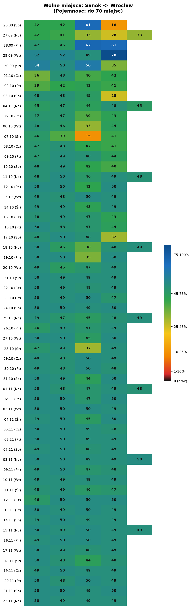
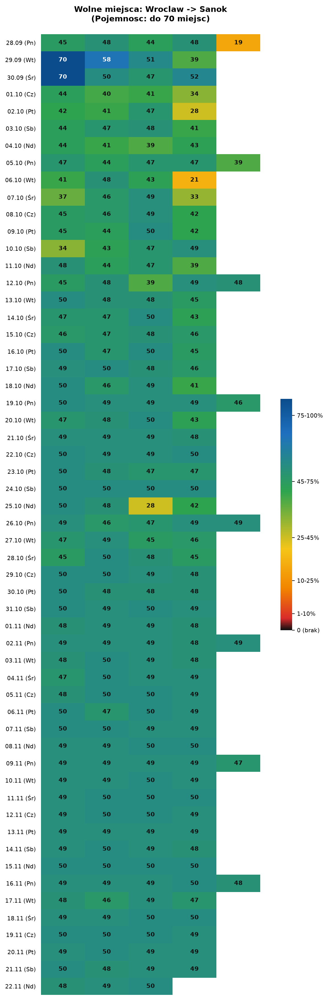

# 🚌 Sentinel N3: Sanok ⇄ Wrocław

> 🕒 **Ostatnia aktualizacja:** `2026-09-30 06:23:22` | 📡 **Aktywny horyzont sprzedaży:** **`28.01.2027`** (121 dni)

## 🚨 1. Dziennik Zmian (Względem poprzedniego pomiaru)

> Poniżej prezentowane są różnice względem poprzedniego sprawdzenia (ubytek foteli lub obniżka ceny).

| Data sprawdzenia | Trasa | Kurs | Zmiana ceny | Zmiana miejsc |
| :--- | :--- | :--- | :---: | :---: |
| `2026-09-30` `06:23:22` | Sanok → Wrocław | 📅 30.09.2026 (10:10 -> 18:50) | 120.65 zł | 34 → **33 szt.** `(-1)` |
| `2026-09-30` `06:23:22` | Sanok → Wrocław | 📅 30.09.2026 (23:50 -> 07:25) | 120.65 zł | 35 → **37 szt.** `(+2)` |
| `2026-09-30` `06:23:22` | Sanok → Wrocław | 📅 01.10.2026 (03:00 -> 10:55) | 120.65 zł | 40 → **42 szt.** `(+2)` |
| `2026-09-30` `06:23:22` | Sanok → Wrocław | 📅 01.10.2026 (23:50 -> 07:25) | 120.65 zł | 42 → **44 szt.** `(+2)` |
| `2026-09-30` `06:23:22` | Sanok → Wrocław | 📅 02.10.2026 (06:35 -> 15:05) | 120.65 zł | 45 → **47 szt.** `(+2)` |
| `2026-09-30` `06:23:22` | Sanok → Wrocław | 📅 02.10.2026 (10:10 -> 18:50) | 120.65 zł | 47 → **49 szt.** `(+2)` |
| `2026-09-30` `06:23:22` | Sanok → Wrocław | 📅 02.10.2026 (23:50 -> 07:25) | 120.65 zł | 34 → **36 szt.** `(+2)` |
| `2026-09-30` `06:23:22` | Sanok → Wrocław | 📅 03.10.2026 (03:00 -> 10:55) | 120.65 zł | 44 → **46 szt.** `(+2)` |
| `2026-09-30` `06:23:22` | Sanok → Wrocław | 📅 03.10.2026 (06:35 -> 15:05) | 120.65 zł | 45 → **47 szt.** `(+2)` |
| `2026-09-30` `06:23:22` | Sanok → Wrocław | 📅 03.10.2026 (10:10 -> 18:50) | 120.65 zł | 42 → **44 szt.** `(+2)` |
| `2026-09-30` `06:23:22` | Sanok → Wrocław | 📅 03.10.2026 (23:50 -> 07:25) | 120.65 zł | 23 → **25 szt.** `(+2)` |
| `2026-09-30` `06:23:22` | Sanok → Wrocław | 📅 04.10.2026 (03:00 -> 10:55) | 120.65 zł | 42 → **44 szt.** `(+2)` |
| `2026-09-30` `06:23:22` | Sanok → Wrocław | 📅 04.10.2026 (06:35 -> 15:05) | 120.65 zł | 43 → **45 szt.** `(+2)` |
| `2026-09-30` `06:23:22` | Sanok → Wrocław | 📅 04.10.2026 (10:10 -> 18:50) | 120.65 zł | 38 → **40 szt.** `(+2)` |
| `2026-09-30` `06:23:22` | Sanok → Wrocław | 📅 04.10.2026 (16:20 -> 00:20) | 120.65 zł | 44 → **46 szt.** `(+2)` |
| `2026-09-30` `06:23:22` | Sanok → Wrocław | 📅 08.10.2026 (10:10 -> 18:50) | 120.65 zł | 40 → **39 szt.** `(-1)` |
| `2026-09-30` `06:23:22` | Sanok → Wrocław | 📅 10.10.2026 (10:10 -> 18:50) | 120.65 zł | 41 → **39 szt.** `(-2)` |
| `2026-09-30` `06:23:22` | Sanok → Wrocław | 📅 15.10.2026 (23:50 -> 07:25) | 120.65 zł | 43 → **40 szt.** `(-3)` |
| `2026-09-30` `06:23:22` | Wrocław → Sanok | 📅 30.09.2026 (12:00 -> 20:14) | 120.65 zł | 45 → **44 szt.** `(-1)` |
| `2026-09-30` `06:23:22` | Wrocław → Sanok | 📅 30.09.2026 (22:25 -> 06:12) | 120.65 zł | 45 → **43 szt.** `(-2)` |
| `2026-09-30` `06:23:22` | Wrocław → Sanok | 📅 01.10.2026 (07:45 -> 15:47) | 120.65 zł | 51 → **53 szt.** `(+2)` |
| `2026-09-30` `06:23:22` | Wrocław → Sanok | 📅 01.10.2026 (15:35 -> 23:36) | 120.65 zł | 46 → **48 szt.** `(+2)` |
| `2026-09-30` `06:23:22` | Wrocław → Sanok | 📅 02.10.2026 (07:45 -> 15:47) | 120.65 zł | 50 → **52 szt.** `(+2)` |
| `2026-09-30` `06:23:22` | Wrocław → Sanok | 📅 02.10.2026 (15:35 -> 23:36) | 120.65 zł | 55 → **57 szt.** `(+2)` |
| `2026-09-30` `06:23:22` | Wrocław → Sanok | 📅 03.10.2026 (07:45 -> 15:47) | 120.65 zł | 43 → **45 szt.** `(+2)` |
| `2026-09-30` `06:23:22` | Wrocław → Sanok | 📅 03.10.2026 (12:00 -> 20:14) | 120.65 zł | 45 → **47 szt.** `(+2)` |
| `2026-09-30` `06:23:22` | Wrocław → Sanok | 📅 03.10.2026 (15:35 -> 23:36) | 120.65 zł | 48 → **50 szt.** `(+2)` |
| `2026-09-30` `06:23:22` | Wrocław → Sanok | 📅 03.10.2026 (22:25 -> 06:12) | 120.65 zł | 38 → **40 szt.** `(+2)` |
| `2026-09-30` `06:23:22` | Wrocław → Sanok | 📅 04.10.2026 (07:45 -> 15:47) | 120.65 zł | 41 → **43 szt.** `(+2)` |
| `2026-09-30` `06:23:22` | Wrocław → Sanok | 📅 04.10.2026 (12:00 -> 20:14) | 120.65 zł | 38 → **40 szt.** `(+2)` |
| `2026-09-30` `06:23:22` | Wrocław → Sanok | 📅 04.10.2026 (15:35 -> 23:36) | 120.65 zł | 36 → **38 szt.** `(+2)` |
| `2026-09-30` `06:23:22` | Wrocław → Sanok | 📅 04.10.2026 (22:25 -> 06:12) | 120.65 zł | 40 → **42 szt.** `(+2)` |
| `2026-09-30` `06:23:22` | Wrocław → Sanok | 📅 05.10.2026 (03:40 -> 11:33) | 120.65 zł | 45 → **47 szt.** `(+2)` |
| `2026-09-30` `06:23:22` | Wrocław → Sanok | 📅 07.10.2026 (22:25 -> 06:12) | 120.65 zł | 33 → **32 szt.** `(-1)` |
| `2026-09-30` `06:23:22` | Wrocław → Sanok | 📅 10.10.2026 (07:45 -> 15:47) | 120.65 zł | 34 → **33 szt.** `(-1)` |
| `2026-09-30` `06:23:22` | Wrocław → Sanok | 📅 18.01.2027 (07:45 -> 15:47) | 120.65 zł | 44 → **46 szt.** `(+2)` |
| `2026-09-30` `06:23:22` | Wrocław → Sanok | 📅 23.01.2027 (12:00 -> 20:14) | 120.65 zł | 47 → **49 szt.** `(+2)` |

---

## 🔥 2. TOP 50 Najbardziej Obleganych Kursów (Końcówki biletów)

> Zestawienie aktualnych kursów o najmniejszej liczbie wolnych miejsc wraz ze wskaźnikiem tempa wyprzedaży.

| Poz. | Trasa | Data | Godzina | Wolne miejsca | Tempo wyprzedaży | Cena | Status |
| :---: | :--- | :--- | :---: | :---: | :---: | :---: | :---: |
| 01 | Sanok → Wrocław | 📅 **07.10.2026** | ⏰ 10:10 -> 18:50 | `[██░░░░░░░░] 17/70` (**17 szt.**) | 🟢 `Stabilnie` | 120.65 zł | [Kup bilet](https://neobus.pl/) |
| 02 | Wrocław → Sanok | 📅 **06.10.2026** | ⏰ 22:25 -> 06:12 | `[██░░░░░░░░] 17/70` (**17 szt.**) | 🟢 `Stabilnie` | 120.65 zł | [Kup bilet](https://neobus.pl/) |
| 03 | Sanok → Wrocław | 📅 **03.10.2026** | ⏰ 23:50 -> 07:25 | `[████░░░░░░] 25/70` (**25 szt.**) | 🔄 `Zwrot` | 120.65 zł | [Kup bilet](https://neobus.pl/) |
| 04 | Sanok → Wrocław | 📅 **06.10.2026** | ⏰ 10:10 -> 18:50 | `[████░░░░░░] 28/70` (**28 szt.**) | 🟢 `Stabilnie` | 120.65 zł | [Kup bilet](https://neobus.pl/) |
| 05 | Wrocław → Sanok | 📅 **25.10.2026** | ⏰ 15:35 -> 23:36 | `[████░░░░░░] 28/70` (**28 szt.**) | 🟢 `Stabilnie` | 120.65 zł | [Kup bilet](https://neobus.pl/) |
| 06 | Sanok → Wrocław | 📅 **17.10.2026** | ⏰ 23:50 -> 07:25 | `[████░░░░░░] 30/70` (**30 szt.**) | 🟢 `Stabilnie` | 120.65 zł | [Kup bilet](https://neobus.pl/) |
| 07 | Sanok → Wrocław | 📅 **28.10.2026** | ⏰ 10:10 -> 18:50 | `[█████░░░░░] 32/70` (**32 szt.**) | 🟢 `Stabilnie` | 120.65 zł | [Kup bilet](https://neobus.pl/) |
| 08 | Wrocław → Sanok | 📅 **01.10.2026** | ⏰ 22:25 -> 06:12 | `[█████░░░░░] 32/70` (**32 szt.**) | 🟢 `Stabilnie` | 120.65 zł | [Kup bilet](https://neobus.pl/) |
| 09 | Wrocław → Sanok | 📅 **02.10.2026** | ⏰ 22:25 -> 06:12 | `[█████░░░░░] 32/70` (**32 szt.**) | 🟢 `Stabilnie` | 120.65 zł | [Kup bilet](https://neobus.pl/) |
| 10 | Wrocław → Sanok | 📅 **07.10.2026** | ⏰ 22:25 -> 06:12 | `[█████░░░░░] 32/70` (**32 szt.**) | 🔥 `5 os./24h` | 120.65 zł | [Kup bilet](https://neobus.pl/) |
| 11 | Sanok → Wrocław | 📅 **30.09.2026** | ⏰ 10:10 -> 18:50 | `[█████░░░░░] 33/70` (**33 szt.**) | 🔥 `5 os./24h` | 120.65 zł | [Kup bilet](https://neobus.pl/) |
| 12 | Wrocław → Sanok | 📅 **07.10.2026** | ⏰ 07:45 -> 15:47 | `[█████░░░░░] 33/70` (**33 szt.**) | 🟢 `Stabilnie` | 120.65 zł | [Kup bilet](https://neobus.pl/) |
| 13 | Wrocław → Sanok | 📅 **10.10.2026** | ⏰ 07:45 -> 15:47 | `[█████░░░░░] 33/70` (**33 szt.**) | 🔥 `5 os./24h` | 120.65 zł | [Kup bilet](https://neobus.pl/) |
| 14 | Sanok → Wrocław | 📅 **19.10.2026** | ⏰ 10:10 -> 18:50 | `[█████░░░░░] 34/70` (**34 szt.**) | 🟢 `Stabilnie` | 120.65 zł | [Kup bilet](https://neobus.pl/) |
| 15 | Wrocław → Sanok | 📅 **01.10.2026** | ⏰ 12:00 -> 20:14 | `[█████░░░░░] 34/70` (**34 szt.**) | 🟢 `Stabilnie` | 120.65 zł | [Kup bilet](https://neobus.pl/) |
| 16 | Sanok → Wrocław | 📅 **05.10.2026** | ⏰ 10:10 -> 18:50 | `[█████░░░░░] 35/70` (**35 szt.**) | 🟢 `Stabilnie` | 120.65 zł | [Kup bilet](https://neobus.pl/) |
| 17 | Sanok → Wrocław | 📅 **02.10.2026** | ⏰ 23:50 -> 07:25 | `[█████░░░░░] 36/70` (**36 szt.**) | 🔄 `Zwrot` | 120.65 zł | [Kup bilet](https://neobus.pl/) |
| 18 | Sanok → Wrocław | 📅 **07.10.2026** | ⏰ 06:35 -> 15:05 | `[█████░░░░░] 36/70` (**36 szt.**) | 🟢 `Stabilnie` | 120.65 zł | [Kup bilet](https://neobus.pl/) |
| 19 | Sanok → Wrocław | 📅 **07.10.2026** | ⏰ 23:50 -> 07:25 | `[█████░░░░░] 36/70` (**36 szt.**) | 🟢 `Stabilnie` | 120.65 zł | [Kup bilet](https://neobus.pl/) |
| 20 | Sanok → Wrocław | 📅 **30.09.2026** | ⏰ 23:50 -> 07:25 | `[█████░░░░░] 37/70` (**37 szt.**) | 🔄 `Zwrot` | 120.65 zł | [Kup bilet](https://neobus.pl/) |
| 21 | Sanok → Wrocław | 📅 **18.10.2026** | ⏰ 10:10 -> 18:50 | `[█████░░░░░] 37/70` (**37 szt.**) | 🟢 `Stabilnie` | 120.65 zł | [Kup bilet](https://neobus.pl/) |
| 22 | Wrocław → Sanok | 📅 **05.10.2026** | ⏰ 22:25 -> 06:12 | `[█████░░░░░] 37/70` (**37 szt.**) | 🟢 `Stabilnie` | 120.65 zł | [Kup bilet](https://neobus.pl/) |
| 23 | Sanok → Wrocław | 📅 **06.10.2026** | ⏰ 23:50 -> 07:25 | `[█████░░░░░] 38/70` (**38 szt.**) | 🟢 `Stabilnie` | 120.65 zł | [Kup bilet](https://neobus.pl/) |
| 24 | Wrocław → Sanok | 📅 **04.10.2026** | ⏰ 15:35 -> 23:36 | `[█████░░░░░] 38/70` (**38 szt.**) | 🔄 `Zwrot` | 120.65 zł | [Kup bilet](https://neobus.pl/) |
| 25 | Sanok → Wrocław | 📅 **04.10.2026** | ⏰ 23:50 -> 07:25 | `[██████░░░░] 39/70` (**39 szt.**) | 🟢 `Stabilnie` | 120.65 zł | [Kup bilet](https://neobus.pl/) |
| 26 | Sanok → Wrocław | 📅 **08.10.2026** | ⏰ 10:10 -> 18:50 | `[██████░░░░] 39/70` (**39 szt.**) | 🔥 `5 os./24h` | 120.65 zł | [Kup bilet](https://neobus.pl/) |
| 27 | Sanok → Wrocław | 📅 **08.10.2026** | ⏰ 23:50 -> 07:25 | `[██████░░░░] 39/70` (**39 szt.**) | 🟢 `Stabilnie` | 120.65 zł | [Kup bilet](https://neobus.pl/) |
| 28 | Sanok → Wrocław | 📅 **10.10.2026** | ⏰ 10:10 -> 18:50 | `[██████░░░░] 39/70` (**39 szt.**) | 🔥 `11 os./24h` | 120.65 zł | [Kup bilet](https://neobus.pl/) |
| 29 | Wrocław → Sanok | 📅 **11.10.2026** | ⏰ 22:25 -> 06:12 | `[██████░░░░] 39/70` (**39 szt.**) | 🟢 `Stabilnie` | 120.65 zł | [Kup bilet](https://neobus.pl/) |
| 30 | Wrocław → Sanok | 📅 **12.10.2026** | ⏰ 12:00 -> 20:14 | `[██████░░░░] 39/70` (**39 szt.**) | 🟢 `Stabilnie` | 120.65 zł | [Kup bilet](https://neobus.pl/) |
| 31 | Wrocław → Sanok | 📅 **18.10.2026** | ⏰ 22:25 -> 06:12 | `[██████░░░░] 39/70` (**39 szt.**) | 🟢 `Stabilnie` | 120.65 zł | [Kup bilet](https://neobus.pl/) |
| 32 | Sanok → Wrocław | 📅 **04.10.2026** | ⏰ 10:10 -> 18:50 | `[██████░░░░] 40/70` (**40 szt.**) | 🔄 `Zwrot` | 120.65 zł | [Kup bilet](https://neobus.pl/) |
| 33 | Sanok → Wrocław | 📅 **10.10.2026** | ⏰ 23:50 -> 07:25 | `[██████░░░░] 40/70` (**40 szt.**) | 🟢 `Stabilnie` | 120.65 zł | [Kup bilet](https://neobus.pl/) |
| 34 | Sanok → Wrocław | 📅 **15.10.2026** | ⏰ 23:50 -> 07:25 | `[██████░░░░] 40/70` (**40 szt.**) | 🔥 `16 os./24h` | 120.65 zł | [Kup bilet](https://neobus.pl/) |
| 35 | Wrocław → Sanok | 📅 **03.10.2026** | ⏰ 22:25 -> 06:12 | `[██████░░░░] 40/70` (**40 szt.**) | 🔄 `Zwrot` | 120.65 zł | [Kup bilet](https://neobus.pl/) |
| 36 | Wrocław → Sanok | 📅 **04.10.2026** | ⏰ 12:00 -> 20:14 | `[██████░░░░] 40/70` (**40 szt.**) | 🔄 `Zwrot` | 120.65 zł | [Kup bilet](https://neobus.pl/) |
| 37 | Wrocław → Sanok | 📅 **06.10.2026** | ⏰ 07:45 -> 15:47 | `[██████░░░░] 40/70` (**40 szt.**) | 🟢 `Stabilnie` | 120.65 zł | [Kup bilet](https://neobus.pl/) |
| 38 | Wrocław → Sanok | 📅 **09.10.2026** | ⏰ 22:25 -> 06:12 | `[██████░░░░] 41/70` (**41 szt.**) | 🟢 `Stabilnie` | 120.65 zł | [Kup bilet](https://neobus.pl/) |
| 39 | Wrocław → Sanok | 📅 **25.10.2026** | ⏰ 22:25 -> 06:12 | `[██████░░░░] 41/70` (**41 szt.**) | 🟢 `Stabilnie` | 120.65 zł | [Kup bilet](https://neobus.pl/) |
| 40 | Sanok → Wrocław | 📅 **01.10.2026** | ⏰ 03:00 -> 10:55 | `[██████░░░░] 42/70` (**42 szt.**) | 🔄 `Zwrot` | 120.65 zł | [Kup bilet](https://neobus.pl/) |
| 41 | Sanok → Wrocław | 📅 **01.10.2026** | ⏰ 10:10 -> 18:50 | `[██████░░░░] 42/70` (**42 szt.**) | 🟢 `Stabilnie` | 120.65 zł | [Kup bilet](https://neobus.pl/) |
| 42 | Sanok → Wrocław | 📅 **12.10.2026** | ⏰ 10:10 -> 18:50 | `[██████░░░░] 42/70` (**42 szt.**) | 🟢 `Stabilnie` | 120.65 zł | [Kup bilet](https://neobus.pl/) |
| 43 | Sanok → Wrocław | 📅 **16.10.2026** | ⏰ 23:50 -> 07:25 | `[██████░░░░] 42/70` (**42 szt.**) | 🟢 `Stabilnie` | 120.65 zł | [Kup bilet](https://neobus.pl/) |
| 44 | Wrocław → Sanok | 📅 **04.10.2026** | ⏰ 22:25 -> 06:12 | `[██████░░░░] 42/70` (**42 szt.**) | 🔄 `Zwrot` | 120.65 zł | [Kup bilet](https://neobus.pl/) |
| 45 | Wrocław → Sanok | 📅 **08.10.2026** | ⏰ 22:25 -> 06:12 | `[██████░░░░] 42/70` (**42 szt.**) | 🟢 `Stabilnie` | 120.65 zł | [Kup bilet](https://neobus.pl/) |
| 46 | Sanok → Wrocław | 📅 **05.10.2026** | ⏰ 23:50 -> 07:25 | `[██████░░░░] 43/70` (**43 szt.**) | 🟢 `Stabilnie` | 120.65 zł | [Kup bilet](https://neobus.pl/) |
| 47 | Sanok → Wrocław | 📅 **14.10.2026** | ⏰ 10:10 -> 18:50 | `[██████░░░░] 43/70` (**43 szt.**) | 🟢 `Stabilnie` | 120.65 zł | [Kup bilet](https://neobus.pl/) |
| 48 | Sanok → Wrocław | 📅 **18.11.2026** | ⏰ 10:10 -> 18:50 | `[██████░░░░] 43/70` (**43 szt.**) | 🟢 `Stabilnie` | 120.65 zł | [Kup bilet](https://neobus.pl/) |
| 49 | Wrocław → Sanok | 📅 **30.09.2026** | ⏰ 15:35 -> 23:36 | `[██████░░░░] 43/70` (**43 szt.**) | 🟢 `Stabilnie` | 120.65 zł | [Kup bilet](https://neobus.pl/) |
| 50 | Wrocław → Sanok | 📅 **30.09.2026** | ⏰ 22:25 -> 06:12 | `[██████░░░░] 43/70` (**43 szt.**) | 🔥 `11 os./24h` | 120.65 zł | [Kup bilet](https://neobus.pl/) |

---

## 🗺️ 3. Mapy Obłożenia (Heatmapy)

### 🚌 Trasa: Sanok ➔ Wrocław

 Wrocław" width="520">

### 🚌 Trasa: Wrocław ➔ Sanok

 Sanok" width="520">

