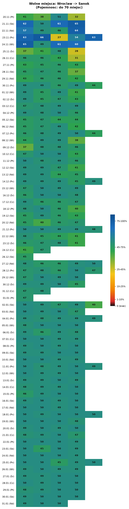

# 🚌 Sentinel N3: Sanok ⇄ Wrocław

> 🕒 **Ostatnia aktualizacja:** `2026-11-19 08:16:57` | 📡 **Aktywny horyzont sprzedaży:** **`31.01.2027`** (74 dni)

> 🌐 **Live Analytics & Archive:** [Otwórz Interaktywne Archiwum](https://gkakol.github.io/Hermes-Protocol/)

## 🚨 1. Dziennik Zmian (Względem poprzedniego pomiaru)

> Poniżej prezentowane są różnice względem poprzedniego sprawdzenia (ubytek foteli lub obniżka ceny).

| Data sprawdzenia | Trasa | Kurs | Zmiana ceny | Zmiana miejsc |
| :--- | :--- | :--- | :---: | :---: |
| `2026-11-19` `08:16:57` | Sanok → Wrocław | 📅 19.11.2026 (10:10 -> 18:50) | 120.65 zł | 55 → **54 szt.** `(-1)` |
| `2026-11-19` `08:16:57` | Sanok → Wrocław | 📅 19.11.2026 (23:50 -> 07:25) | 120.65 zł | 39 → **37 szt.** `(-2)` |
| `2026-11-19` `08:16:57` | Sanok → Wrocław | 📅 20.11.2026 (06:35 -> 15:05) | 120.65 zł | 41 → **40 szt.** `(-1)` |
| `2026-11-19` `08:16:57` | Sanok → Wrocław | 📅 20.11.2026 (10:10 -> 18:50) | 120.65 zł | 45 → **43 szt.** `(-2)` |
| `2026-11-19` `08:16:57` | Sanok → Wrocław | 📅 20.11.2026 (23:50 -> 07:25) | 120.65 zł | 48 → **50 szt.** `(+2)` |
| `2026-11-19` `08:16:57` | Sanok → Wrocław | 📅 21.11.2026 (06:35 -> 15:05) | 120.65 zł | 50 → **48 szt.** `(-2)` |
| `2026-11-19` `08:16:57` | Sanok → Wrocław | 📅 21.11.2026 (10:10 -> 18:50) | 120.65 zł | 54 → **56 szt.** `(+2)` |
| `2026-11-19` `08:16:57` | Sanok → Wrocław | 📅 22.11.2026 (03:00 -> 10:55) | 69.00 zł | 50 → **52 szt.** `(+2)` |
| `2026-11-19` `08:16:57` | Sanok → Wrocław | 📅 22.11.2026 (10:10 -> 18:50) | 120.65 zł | 60 → **62 szt.** `(+2)` |
| `2026-11-19` `08:16:57` | Sanok → Wrocław | 📅 22.11.2026 (16:20 -> 00:20) | 120.65 zł | 52 → **54 szt.** `(+2)` |
| `2026-11-19` `08:16:57` | Sanok → Wrocław | 📅 22.11.2026 (23:50 -> 07:25) | 120.65 zł | 50 → **52 szt.** `(+2)` |
| `2026-11-19` `08:16:57` | Sanok → Wrocław | 📅 23.11.2026 (10:10 -> 18:50) | 120.65 zł | 52 → **54 szt.** `(+2)` |
| `2026-11-19` `08:16:57` | Sanok → Wrocław | 📅 23.11.2026 (23:50 -> 07:25) | 120.65 zł | 50 → **52 szt.** `(+2)` |
| `2026-11-19` `08:16:57` | Sanok → Wrocław | 📅 24.11.2026 (06:35 -> 15:05) | 120.65 zł | 58 → **60 szt.** `(+2)` |
| `2026-11-19` `08:16:57` | Sanok → Wrocław | 📅 24.11.2026 (10:10 -> 18:50) | 120.65 zł | 59 → **61 szt.** `(+2)` |
| `2026-11-19` `08:16:57` | Sanok → Wrocław | 📅 24.11.2026 (23:50 -> 07:25) | 120.65 zł | 47 → **42 szt.** `(-5)` |
| `2026-11-19` `08:16:57` | Sanok → Wrocław | 📅 25.11.2026 (03:00 -> 10:55) | 120.65 zł | 46 → **45 szt.** `(-1)` |
| `2026-11-19` `08:16:57` | Sanok → Wrocław | 📅 25.11.2026 (10:10 -> 18:50) | 120.65 zł | 43 → **42 szt.** `(-1)` |
| `2026-11-19` `08:16:57` | Sanok → Wrocław | 📅 29.11.2026 (03:00 -> 10:55) | 19.00 zł | 49 → **48 szt.** `(-1)` |
| `2026-11-19` `08:16:57` | Sanok → Wrocław | 📅 29.11.2026 (10:10 -> 18:50) | 120.65 zł | 43 → **42 szt.** `(-1)` |
| `2026-11-19` `08:16:57` | Sanok → Wrocław | 📅 19.12.2026 (10:10 -> 18:50) | 120.65 zł | 45 → **44 szt.** `(-1)` |
| `2026-11-19` `08:16:57` | Sanok → Wrocław | 📅 05.01.2027 (06:35 -> 15:05) | 120.65 zł | 50 → **49 szt.** `(-1)` |
| `2026-11-19` `08:16:57` | Wrocław → Sanok | 📅 19.11.2026 (12:00 -> 20:14) | 120.65 zł | 40 → **39 szt.** `(-1)` |
| `2026-11-19` `08:16:57` | Wrocław → Sanok | 📅 21.11.2026 (07:45 -> 15:47) | 120.65 zł | 54 → **56 szt.** `(+2)` |
| `2026-11-19` `08:16:57` | Wrocław → Sanok | 📅 21.11.2026 (12:00 -> 20:14) | 120.65 zł | 54 → **52 szt.** `(-2)` |
| `2026-11-19` `08:16:57` | Wrocław → Sanok | 📅 21.11.2026 (15:35 -> 23:36) | 120.65 zł | 57 → **59 szt.** `(+2)` |
| `2026-11-19` `08:16:57` | Wrocław → Sanok | 📅 21.11.2026 (22:25 -> 06:12) | 120.65 zł | 57 → **59 szt.** `(+2)` |
| `2026-11-19` `08:16:57` | Wrocław → Sanok | 📅 22.11.2026 (07:45 -> 15:47) | 120.65 zł | 57 → **59 szt.** `(+2)` |
| `2026-11-19` `08:16:57` | Wrocław → Sanok | 📅 22.11.2026 (15:35 -> 23:36) | 120.65 zł | 49 → **48 szt.** `(-1)` |
| `2026-11-19` `08:16:57` | Wrocław → Sanok | 📅 22.11.2026 (22:25 -> 06:12) | 120.65 zł | 56 → **58 szt.** `(+2)` |
| `2026-11-19` `08:16:57` | Wrocław → Sanok | 📅 23.11.2026 (03:40 -> 11:33) | 120.65 zł | 59 → **61 szt.** `(+2)` |
| `2026-11-19` `08:16:57` | Wrocław → Sanok | 📅 23.11.2026 (07:45 -> 15:47) | 120.65 zł | 58 → **60 szt.** `(+2)` |
| `2026-11-19` `08:16:57` | Wrocław → Sanok | 📅 23.11.2026 (22:25 -> 06:12) | 120.65 zł | 61 → **63 szt.** `(+2)` |
| `2026-11-19` `08:16:57` | Wrocław → Sanok | 📅 24.11.2026 (07:45 -> 15:47) | 19.00 zł | 57 → **59 szt.** `(+2)` |
| `2026-11-19` `08:16:57` | Wrocław → Sanok | 📅 24.11.2026 (12:00 -> 20:14) | 120.65 zł | 47 → **49 szt.** `(+2)` |
| `2026-11-19` `08:16:57` | Wrocław → Sanok | 📅 24.11.2026 (15:35 -> 23:36) | 120.65 zł | 59 → **61 szt.** `(+2)` |
| `2026-11-19` `08:16:57` | Wrocław → Sanok | 📅 24.11.2026 (22:25 -> 06:12) | 120.65 zł | 56 → **58 szt.** `(+2)` |
| `2026-11-19` `08:16:57` | Wrocław → Sanok | 📅 25.11.2026 (07:45 -> 15:47) | 59.00 zł | 39 → **38 szt.** `(-1)` |
| `2026-11-19` `08:16:57` | Wrocław → Sanok | 📅 26.11.2026 (12:00 -> 20:14) | 120.65 zł | 48 → **46 szt.** `(-2)` |
| `2026-11-19` `08:16:57` | Wrocław → Sanok | 📅 26.11.2026 (15:35 -> 23:36) | 120.65 zł | 45 → **43 szt.** `(-2)` |
| `2026-11-19` `08:16:57` | Wrocław → Sanok | 📅 27.11.2026 (07:45 -> 15:47) | 120.65 zł | 44 → **43 szt.** `(-1)` |
| `2026-11-19` `08:16:57` | Wrocław → Sanok | 📅 02.12.2026 (22:25 -> 06:12) | 120.65 zł | 47 → **43 szt.** `(-4)` |
| `2026-11-19` `08:16:57` | Wrocław → Sanok | 📅 05.12.2026 (07:45 -> 15:47) | 120.65 zł | 46 → **45 szt.** `(-1)` |
| `2026-11-19` `08:16:57` | Wrocław → Sanok | 📅 12.01.2027 (07:45 -> 15:47) | 120.65 zł | 49 → **48 szt.** `(-1)` |

---

## 🔥 2. TOP 50 Najbardziej Obleganych Kursów (Końcówki biletów)

> Zestawienie aktualnych kursów o najmniejszej liczbie wolnych miejsc wraz ze wskaźnikiem tempa wyprzedaży.

| Poz. | Trasa | Data | Godzina | Wolne miejsca | Tempo wyprzedaży | Cena | Status |
| :---: | :--- | :--- | :---: | :---: | :---: | :---: | :---: |
| 01 | Sanok → Wrocław | 📅 **01.12.2026** | ⏰ 10:10 -> 18:50 | `[███░░░░░░░] 24/70` (**24 szt.**) | 🟢 `Stabilnie` | 120.65 zł | [Kup bilet](https://neobus.pl/) |
| 02 | Wrocław → Sanok | 📅 **23.11.2026** | ⏰ 12:00 -> 20:14 | `[████░░░░░░] 28/70` (**28 szt.**) | 🟢 `Stabilnie` | 120.65 zł | [Kup bilet](https://neobus.pl/) |
| 03 | Wrocław → Sanok | 📅 **25.11.2026** | ⏰ 22:25 -> 06:12 | `[████░░░░░░] 28/70` (**28 szt.**) | 🟢 `Stabilnie` | 120.65 zł | [Kup bilet](https://neobus.pl/) |
| 04 | Sanok → Wrocław | 📅 **09.12.2026** | ⏰ 10:10 -> 18:50 | `[████░░░░░░] 30/70` (**30 szt.**) | 🟢 `Stabilnie` | 120.65 zł | [Kup bilet](https://neobus.pl/) |
| 05 | Wrocław → Sanok | 📅 **26.11.2026** | ⏰ 22:25 -> 06:12 | `[█████░░░░░] 32/70` (**32 szt.**) | 🟢 `Stabilnie` | 120.65 zł | [Kup bilet](https://neobus.pl/) |
| 06 | Sanok → Wrocław | 📅 **30.12.2026** | ⏰ 10:10 -> 18:50 | `[█████░░░░░] 35/70` (**35 szt.**) | 🟢 `Stabilnie` | 120.65 zł | [Kup bilet](https://neobus.pl/) |
| 07 | Sanok → Wrocław | 📅 **27.12.2026** | ⏰ 10:10 -> 18:50 | `[█████░░░░░] 36/70` (**36 szt.**) | 🟢 `Stabilnie` | 120.65 zł | [Kup bilet](https://neobus.pl/) |
| 08 | Sanok → Wrocław | 📅 **19.11.2026** | ⏰ 23:50 -> 07:25 | `[█████░░░░░] 37/70` (**37 szt.**) | 🔥 `5 os./24h` | 120.65 zł | [Kup bilet](https://neobus.pl/) |
| 09 | Sanok → Wrocław | 📅 **25.11.2026** | ⏰ 23:50 -> 07:25 | `[█████░░░░░] 37/70` (**37 szt.**) | 🟢 `Stabilnie` | 120.65 zł | [Kup bilet](https://neobus.pl/) |
| 10 | Wrocław → Sanok | 📅 **25.11.2026** | ⏰ 07:45 -> 15:47 | `[█████░░░░░] 38/70` (**38 szt.**) | ⚡ `3 os./24h` | 59.00 zł | [Kup bilet](https://neobus.pl/) |
| 11 | Wrocław → Sanok | 📅 **09.12.2026** | ⏰ 07:45 -> 15:47 | `[█████░░░░░] 38/70` (**38 szt.**) | 🟢 `Stabilnie` | 120.65 zł | [Kup bilet](https://neobus.pl/) |
| 12 | Sanok → Wrocław | 📅 **29.11.2026** | ⏰ 16:20 -> 00:20 | `[██████░░░░] 39/70` (**39 szt.**) | 🟢 `Stabilnie` | 120.65 zł | [Kup bilet](https://neobus.pl/) |
| 13 | Sanok → Wrocław | 📅 **01.12.2026** | ⏰ 23:50 -> 07:25 | `[██████░░░░] 39/70` (**39 szt.**) | 🟢 `Stabilnie` | 120.65 zł | [Kup bilet](https://neobus.pl/) |
| 14 | Sanok → Wrocław | 📅 **09.12.2026** | ⏰ 23:50 -> 07:25 | `[██████░░░░] 39/70` (**39 szt.**) | 🟢 `Stabilnie` | 120.65 zł | [Kup bilet](https://neobus.pl/) |
| 15 | Wrocław → Sanok | 📅 **19.11.2026** | ⏰ 12:00 -> 20:14 | `[██████░░░░] 39/70` (**39 szt.**) | ⚡ `3 os./24h` | 120.65 zł | [Kup bilet](https://neobus.pl/) |
| 16 | Wrocław → Sanok | 📅 **28.11.2026** | ⏰ 22:25 -> 06:12 | `[██████░░░░] 39/70` (**39 szt.**) | 🟢 `Stabilnie` | 120.65 zł | [Kup bilet](https://neobus.pl/) |
| 17 | Sanok → Wrocław | 📅 **20.11.2026** | ⏰ 06:35 -> 15:05 | `[██████░░░░] 40/70` (**40 szt.**) | ⚡ `3 os./24h` | 120.65 zł | [Kup bilet](https://neobus.pl/) |
| 18 | Sanok → Wrocław | 📅 **27.11.2026** | ⏰ 10:10 -> 18:50 | `[██████░░░░] 40/70` (**40 szt.**) | 🟢 `Stabilnie` | 120.65 zł | [Kup bilet](https://neobus.pl/) |
| 19 | Sanok → Wrocław | 📅 **22.12.2026** | ⏰ 10:10 -> 18:50 | `[██████░░░░] 40/70` (**40 szt.**) | 🟢 `Stabilnie` | 120.65 zł | [Kup bilet](https://neobus.pl/) |
| 20 | Wrocław → Sanok | 📅 **08.12.2026** | ⏰ 22:25 -> 06:12 | `[██████░░░░] 40/70` (**40 szt.**) | 🟢 `Stabilnie` | 120.65 zł | [Kup bilet](https://neobus.pl/) |
| 21 | Wrocław → Sanok | 📅 **20.12.2026** | ⏰ 12:00 -> 20:14 | `[██████░░░░] 40/70` (**40 szt.**) | 🟢 `Stabilnie` | 120.65 zł | [Kup bilet](https://neobus.pl/) |
| 22 | Sanok → Wrocław | 📅 **04.12.2026** | ⏰ 10:10 -> 18:50 | `[██████░░░░] 41/70` (**41 szt.**) | 🟢 `Stabilnie` | 120.65 zł | [Kup bilet](https://neobus.pl/) |
| 23 | Sanok → Wrocław | 📅 **08.12.2026** | ⏰ 10:10 -> 18:50 | `[██████░░░░] 41/70` (**41 szt.**) | 🟢 `Stabilnie` | 120.65 zł | [Kup bilet](https://neobus.pl/) |
| 24 | Sanok → Wrocław | 📅 **23.12.2026** | ⏰ 10:10 -> 18:50 | `[██████░░░░] 41/70` (**41 szt.**) | 🟢 `Stabilnie` | 120.65 zł | [Kup bilet](https://neobus.pl/) |
| 25 | Sanok → Wrocław | 📅 **29.12.2026** | ⏰ 10:10 -> 18:50 | `[██████░░░░] 41/70` (**41 szt.**) | 🟢 `Stabilnie` | 120.65 zł | [Kup bilet](https://neobus.pl/) |
| 26 | Wrocław → Sanok | 📅 **25.11.2026** | ⏰ 12:00 -> 20:14 | `[██████░░░░] 41/70` (**41 szt.**) | 🟢 `Stabilnie` | 120.65 zł | [Kup bilet](https://neobus.pl/) |
| 27 | Wrocław → Sanok | 📅 **01.12.2026** | ⏰ 22:25 -> 06:12 | `[██████░░░░] 41/70` (**41 szt.**) | 🟢 `Stabilnie` | 120.65 zł | [Kup bilet](https://neobus.pl/) |
| 28 | Wrocław → Sanok | 📅 **12.12.2026** | ⏰ 22:25 -> 06:12 | `[██████░░░░] 41/70` (**41 szt.**) | 🟢 `Stabilnie` | 120.65 zł | [Kup bilet](https://neobus.pl/) |
| 29 | Wrocław → Sanok | 📅 **23.12.2026** | ⏰ 22:25 -> 06:12 | `[██████░░░░] 41/70` (**41 szt.**) | 🟢 `Stabilnie` | 120.65 zł | [Kup bilet](https://neobus.pl/) |
| 30 | Wrocław → Sanok | 📅 **24.12.2026** | ⏰ 07:45 -> 15:47 | `[██████░░░░] 41/70` (**41 szt.**) | 🟢 `Stabilnie` | 120.65 zł | [Kup bilet](https://neobus.pl/) |
| 31 | Sanok → Wrocław | 📅 **24.11.2026** | ⏰ 23:50 -> 07:25 | `[██████░░░░] 42/70` (**42 szt.**) | 🔥 `13 os./24h` | 120.65 zł | [Kup bilet](https://neobus.pl/) |
| 32 | Sanok → Wrocław | 📅 **25.11.2026** | ⏰ 10:10 -> 18:50 | `[██████░░░░] 42/70` (**42 szt.**) | ⚡ `3 os./24h` | 120.65 zł | [Kup bilet](https://neobus.pl/) |
| 33 | Sanok → Wrocław | 📅 **26.11.2026** | ⏰ 10:10 -> 18:50 | `[██████░░░░] 42/70` (**42 szt.**) | 🟢 `Stabilnie` | 120.65 zł | [Kup bilet](https://neobus.pl/) |
| 34 | Sanok → Wrocław | 📅 **29.11.2026** | ⏰ 10:10 -> 18:50 | `[██████░░░░] 42/70` (**42 szt.**) | ⚡ `3 os./24h` | 120.65 zł | [Kup bilet](https://neobus.pl/) |
| 35 | Sanok → Wrocław | 📅 **04.12.2026** | ⏰ 23:50 -> 07:25 | `[██████░░░░] 42/70` (**42 szt.**) | 🟢 `Stabilnie` | 120.65 zł | [Kup bilet](https://neobus.pl/) |
| 36 | Sanok → Wrocław | 📅 **18.12.2026** | ⏰ 10:10 -> 18:50 | `[██████░░░░] 42/70` (**42 szt.**) | 🟢 `Stabilnie` | 120.65 zł | [Kup bilet](https://neobus.pl/) |
| 37 | Sanok → Wrocław | 📅 **23.12.2026** | ⏰ 23:50 -> 07:25 | `[██████░░░░] 42/70` (**42 szt.**) | 🟢 `Stabilnie` | 120.65 zł | [Kup bilet](https://neobus.pl/) |
| 38 | Wrocław → Sanok | 📅 **29.11.2026** | ⏰ 22:25 -> 06:12 | `[██████░░░░] 42/70` (**42 szt.**) | 🟢 `Stabilnie` | 120.65 zł | [Kup bilet](https://neobus.pl/) |
| 39 | Wrocław → Sanok | 📅 **06.12.2026** | ⏰ 22:25 -> 06:12 | `[██████░░░░] 42/70` (**42 szt.**) | 🟢 `Stabilnie` | 120.65 zł | [Kup bilet](https://neobus.pl/) |
| 40 | Wrocław → Sanok | 📅 **18.12.2026** | ⏰ 22:25 -> 06:12 | `[██████░░░░] 42/70` (**42 szt.**) | 🟢 `Stabilnie` | 120.65 zł | [Kup bilet](https://neobus.pl/) |
| 41 | Wrocław → Sanok | 📅 **02.01.2027** | ⏰ 22:25 -> 06:12 | `[██████░░░░] 42/70` (**42 szt.**) | 🟢 `Stabilnie` | 120.65 zł | [Kup bilet](https://neobus.pl/) |
| 42 | Sanok → Wrocław | 📅 **26.11.2026** | ⏰ 06:35 -> 15:05 | `[██████░░░░] 43/70` (**43 szt.**) | 🟢 `Stabilnie` | 59.00 zł | [Kup bilet](https://neobus.pl/) |
| 43 | Sanok → Wrocław | 📅 **20.11.2026** | ⏰ 10:10 -> 18:50 | `[██████░░░░] 43/70` (**43 szt.**) | 🔥 `5 os./24h` | 120.65 zł | [Kup bilet](https://neobus.pl/) |
| 44 | Sanok → Wrocław | 📅 **27.11.2026** | ⏰ 23:50 -> 07:25 | `[██████░░░░] 43/70` (**43 szt.**) | 🟢 `Stabilnie` | 120.65 zł | [Kup bilet](https://neobus.pl/) |
| 45 | Sanok → Wrocław | 📅 **03.01.2027** | ⏰ 23:50 -> 07:25 | `[██████░░░░] 43/70` (**43 szt.**) | 🟢 `Stabilnie` | 120.65 zł | [Kup bilet](https://neobus.pl/) |
| 46 | Wrocław → Sanok | 📅 **26.11.2026** | ⏰ 15:35 -> 23:36 | `[██████░░░░] 43/70` (**43 szt.**) | ⚡ `3 os./24h` | 120.65 zł | [Kup bilet](https://neobus.pl/) |
| 47 | Wrocław → Sanok | 📅 **27.11.2026** | ⏰ 07:45 -> 15:47 | `[██████░░░░] 43/70` (**43 szt.**) | ⚡ `3 os./24h` | 120.65 zł | [Kup bilet](https://neobus.pl/) |
| 48 | Wrocław → Sanok | 📅 **27.11.2026** | ⏰ 22:25 -> 06:12 | `[██████░░░░] 43/70` (**43 szt.**) | 🟢 `Stabilnie` | 120.65 zł | [Kup bilet](https://neobus.pl/) |
| 49 | Wrocław → Sanok | 📅 **29.11.2026** | ⏰ 07:45 -> 15:47 | `[██████░░░░] 43/70` (**43 szt.**) | 🟢 `Stabilnie` | 120.65 zł | [Kup bilet](https://neobus.pl/) |
| 50 | Wrocław → Sanok | 📅 **02.12.2026** | ⏰ 22:25 -> 06:12 | `[██████░░░░] 43/70` (**43 szt.**) | 🔥 `10 os./24h` | 120.65 zł | [Kup bilet](https://neobus.pl/) |

---

## 🗺️ 3. Mapy Obłożenia (Heatmapy)

### 🚌 Trasa: Sanok ➔ Wrocław

 Wrocław" width="520">

### 🚌 Trasa: Wrocław ➔ Sanok

 Sanok" width="520">

